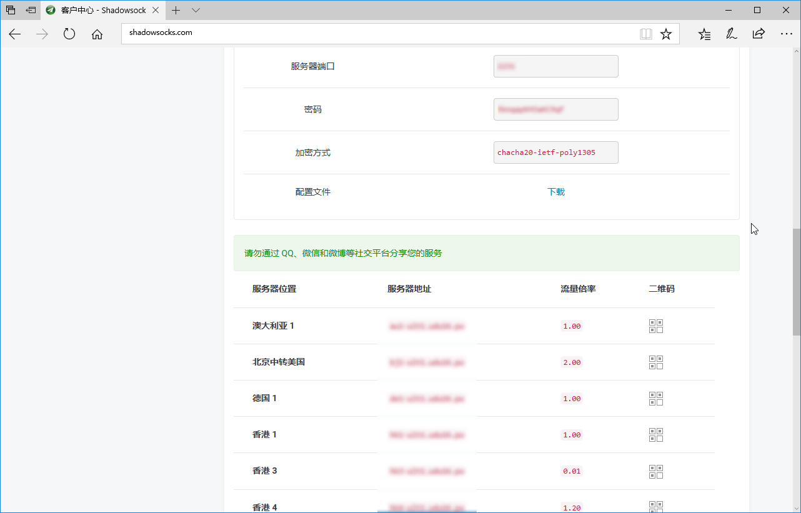

# Shadowsocks 设置方法 (Linux)

* [GUI 客户端 Shadowsocks-QT5](#Shadowosocks-QT5)
* [命令行客户端](#命令行客户端)

## Shadowosocks-QT5

下面以 Ubuntu 64 位系统做参考，其他系统请参考 [安装指南](https://github.com/shadowsocks/shadowsocks-qt5/wiki/%E5%AE%89%E8%A3%85%E6%8C%87%E5%8D%97)

## 安装 Shadowsocks-Qt5
按照下面的说明在 Ubuntu 上下载并安装 Shadowsocks-Qt5。

#### 1. 下载客户端

转到 Shadowsocks [下载页面](https://github.com/shadowsocks/shadowsocks-qt5/releases)。
点击最新版本的 `Shadowsocks-Qt5-x.x.x-x86_64.AppImage` 进行下载 (`x.x.x`为版本号) 。


#### 2. 安装客户端

右键单击 "Shadowsocks-Qt5-x.x.x-x86_64.AppImage"  > 选择 "Properties" > 单击 "Permissions" > 在"Allow excuting file as program" 上打勾。


## 配置 Shadowsocks 账号

#### 登陆我们的[网站](https://portal.shadowsocks.center), 执行下列操作：

* 单击 “服务” > "我的服务" > 选择 "你可用的产品/服务"。

* 查看你的节点信息。



#### 在您的电脑上， 执行下列操作：

* 双击`Shadowsocks-Qt5-x.x.x-x86_64.AppImage` > "Connection" > "Add" > "Manually"。


* 填写 "Server Address" （为你的节点服务器地址）> 填写"Server Port"（为你的服务端口) > 填写 "Password" （为你的登陆密码)。

* 在 "Local Address" 处填上 "127.0.0.1" > 在 "local Port" 处填上 "1080" > 选择 "Encryption Method" （为你的加密方式)。

>勾选 "Auto connect to connect on application start", 将会在开启 Shadowsocks-QT5 时自动连接至该服务器。


#### 您也可以通过二维码方式单独增加节点，在您的计算机上， 执行下列操作：
此二维码同样适用于其他客户端。

* 双击`Shadowsocks-Qt5-x.x.x-x86_64.AppImage` > "Connection" > "Add" > "Scan QR code on Screen" > 当弹出新的 "Profile Editor"后，点击 "OK"。

* 点击 "Connect" 图标 。


## 命令行客户端
### 1. 安装：
Python : https://github.com/shadowsocks/shadowsocks/tree/master#install  
Shadowsocks-libev: https://github.com/shadowsocks/shadowsocks-libev#installation

下面我们以 [Python 版](https://pypi.python.org/pypi/shadowsocks)的 Shadowsocks 为例

安装命令：  
Debian / Ubuntu:  
```
apt-get install python-pip
pip install git+https://github.com/shadowsocks/shadowsocks.git@master
```

CentOS:  
```
yum install python-setuptools && easy_install pip
pip install git+https://github.com/shadowsocks/shadowsocks.git@master
```

For CentOS 7, if you need AEAD ciphers, you need install libsodium  
```
dnf install libsodium python34-pip
pip3 install  git+https://github.com/shadowsocks/shadowsocks.git@master
```

Linux distributions with snap:  
```
snap install shadowsocks
```

### 2. 创建 Shadowsocks 配置文件

创建一个 `/etc/shadowsocks.json` 文件，格式如下

```
{
    "server":"服务器 IP 或是域名",
    "server_port":端口号,
    "local_address": "127.0.0.1",
    "local_port":1080,
    "password":"密码",
    "timeout":300,
    "method":"加密方式 (chacha20-ietf-poly1305 / aes-256-cfb)",
    "fast_open": false
}
```

### 3、启动 Shadowsocks
Python 版客户端命令是 sslocal ， Shadowsocks-libev 客户端命令为 ss-local  

```
/usr/local/bin/sslocal -c /etc/shadowsocks.json -d start
```


### 4、终端内使用，需安裝 proxychains

Debian / Ubuntu：

```
sudo apt-get install proxychains
```

编辑 `/etc/proxychains.conf`

修改最后一行

```
socks5 127.0.0.1 1080
```

接着我们就可以直接 用 `proxychains` + 命令的方式使用代理，例如

```
proxychains curl xxxx
proxychains wget xxxx

sudo proxychains apt-get xxxx
```

### 5、其他程序使用
需要在程序内设置一个协议为 socks v5 的代理
```
服务器：127.0.0.1
端口：1080 #应与Shadowsocks客户端的本地端口对应，默认为1080
```
### 6、 关闭 Shadowsocks

在终端内输入

```
lsof –i:1080
```

kill 相应的 pid 即可

## 	配置 Firefox 的代理

**如需使用 Firefox 浏览器	通过代理浏览网页，请参考下面链接：**  
[Firefox上设置代理](7-1-firefox-setup-guide-cn.md)


## 配置 Chrome 的代理

**如需使用 Chrome 浏览器通过代理浏览网页，请参考下面链接：**  
[Chrome + Proxy SwitchyOmega 设置](7-2-chrome-setup-guide-cn.md)
