# macOS 下 ClashX 使用教程 
注：本文截图所对应的系统与客户端版本为：  
macOS 10.14  
ClashX 1.16.4

ClashX 支持 Shadowsoks 协议以及 V2Ray 的 vmess 协议

- [macOS 下 ClashX 使用教程](#macos-下-clashx-使用教程)
  - [下载客户端](#下载客户端)
  - [获取配置文件](#获取配置文件)
  - [安装 ClashX](#安装-clashx)
  - [运行 ClashX](#运行-clashx)
  - [添加配置文件](#添加配置文件)
  - [切换配置文件 与 选择节点](#切换配置文件-与-选择节点)
  - [开启系统代理](#开启系统代理)
  - [通过延迟测试判断可用节点](#通过延迟测试判断可用节点)
  - [出站规则介绍](#出站规则介绍)
  - [Chrome / Firefox 配合 Proxy SwitchOmega 扩展](#chrome--firefox-配合-proxy-switchomega-扩展)
      - [配置 Firefox 的代理](#配置-firefox-的代理)
      - [配置 Chrome 的代理](#配置-chrome-的代理)

## 下载客户端
- 从本站 [资源下载](https://portal.shadowsocks.center/download/category/5/V2Ray-.html) 中下载： [Clash for Windows 点击下载](https://portal.shadowsocks.center/dl.php?type=d&id=85) | [ClashX(macOS) 点击下载](https://portal.shadowsocks.center/dl.php?type=d&id=84)
- Clash for Windows: [Github](https://github.com/Fndroid/clash_for_windows_pkg/releases)
- ClashX (macOS): [Github](https://github.com/yichengchen/clashX/releases)

## 获取配置文件
注：目前我们尚未提供订阅链接的支持，请直接下载配置文件使用  

访问客户中心，依次点击 产品服务 > [我的产品与服务](https://portal.shadowsocks.center/clientarea.php?action=services
) 打开服务详情。  

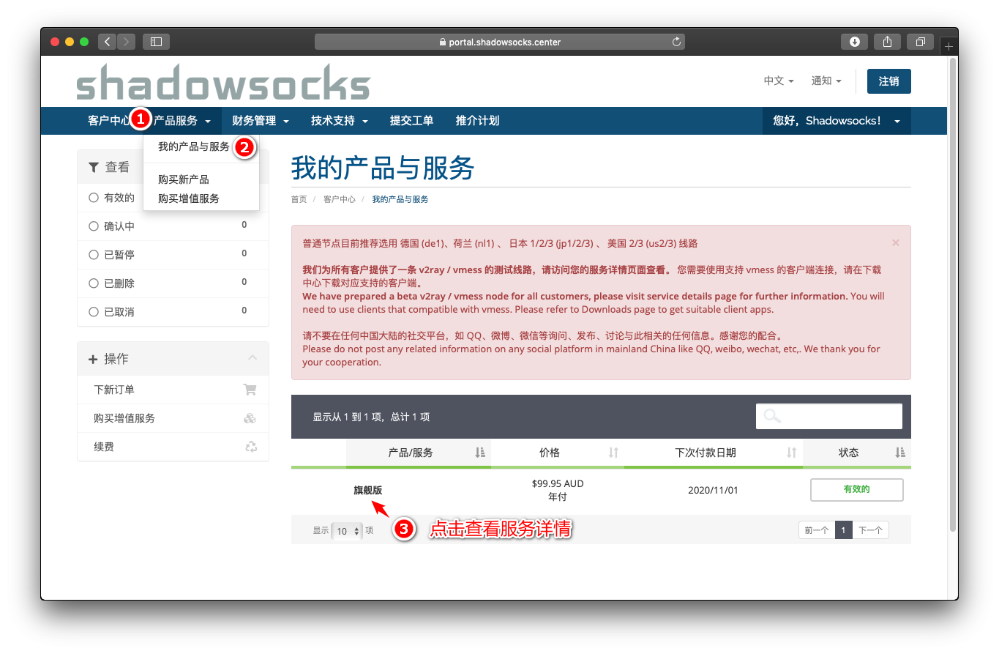

然后打开配置文件下载窗口，获取 Clash 的配置文件。
单击下载按钮，下载文件名为 Shadowsocks_xxxxx.yaml 的配置文件。  

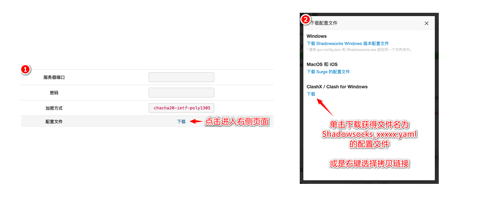

## 安装 ClashX
双击 `下载客户端` 步骤中下载的 `clashx.dmg` 文件，在弹出的窗口中，将 ClashX 图标拖动到右侧的 Application 文件夹内即可完成安装。

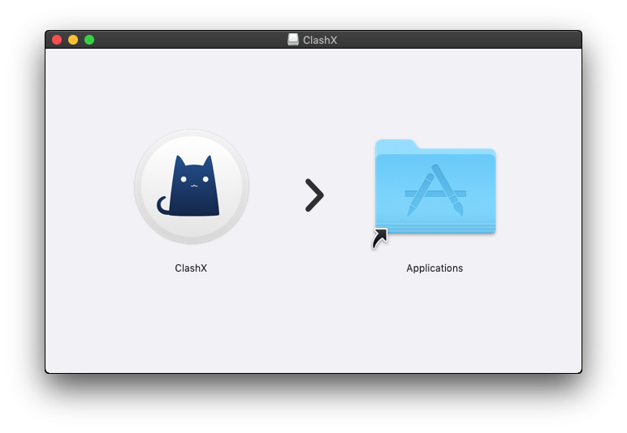

## 运行 ClashX

随后打开程序列表（启动台） ，找到 ClashX 的图标，单击开打，在随后的权限请求中，均选择允许（或是打开），初次使用时需要输入 macOS 的用户密码进行设置。

在程序列表中找到并打开 ClashX   

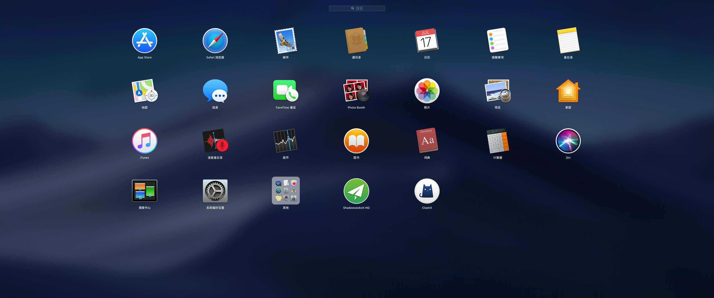  

由于 ClashX 不是从 AppStore 进行安装的，所以系统会进行确认，选择打开：   
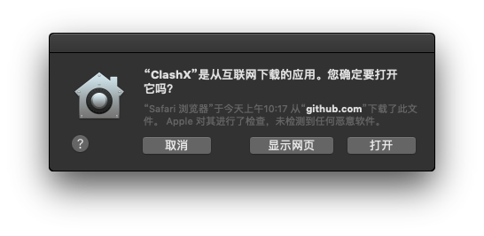  

第一次打开时需要输入用户密码进行权限授权用于初次设置 (点击安装，随后输入用户密码，选择 `安装帮助程序` )：   
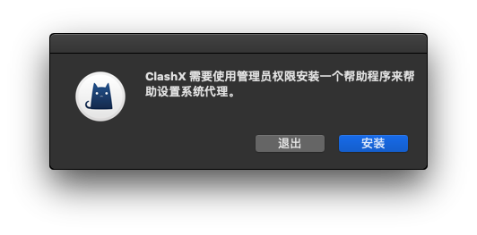   
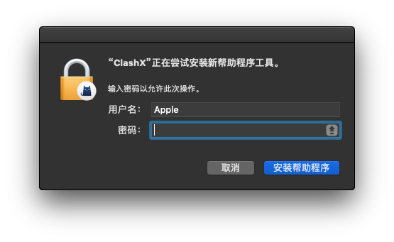  

随后可以在右上角看到 ClashX 的程序图标  

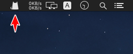

## 添加配置文件  
在右上角的 ClashX 图标上单击，依次选择 `配置 > 打开配置文件夹` （或是直接按 `⌘+O` 打开）

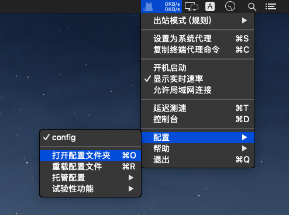

将之前步骤中下载得到的 Shadowsocks_xxxxx.yaml 文件复制到打开的窗口中  

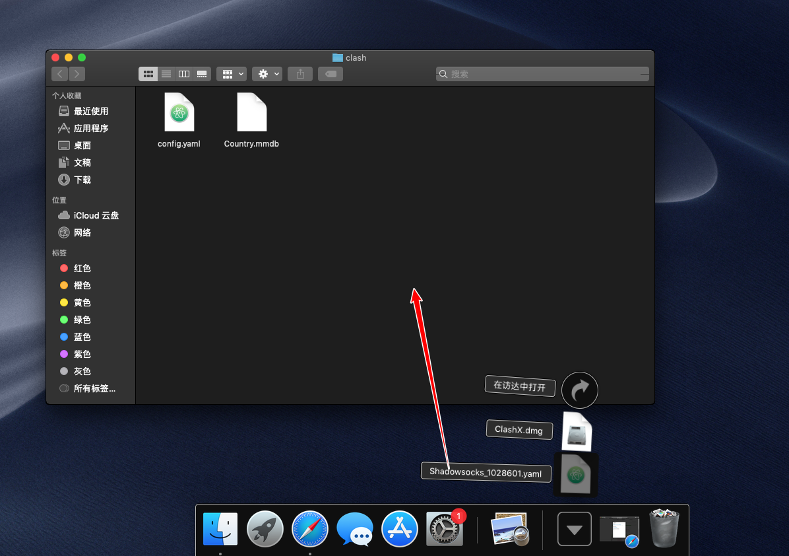  

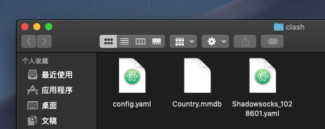

## 切换配置文件 与 选择节点

添加完成后，点击右上角的 ClashX 图标，切换到刚才添加的配置文件：

**点击 `配置` 选择新添加的 `Shadowsocks_xxxxx`。**  

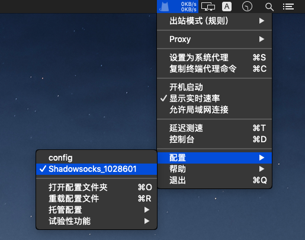

然后再次点击 ClashX 图标，点击 `proxy` 选择需要使用的节点

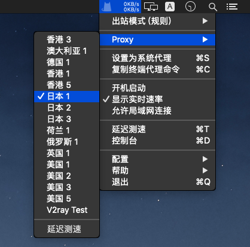  

## 开启系统代理
点击 ClashX 图标，选择 `设置为系统代理` ，即可开启系统代理，为 Safari 以及未安装扩展的 Chrome / Firefox 浏览器提供代理  

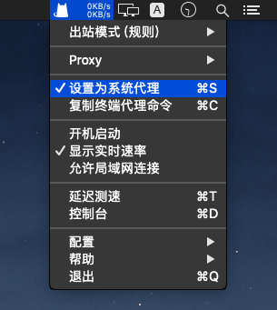  

这时可以使用 Safari 访问 [https://www.google.com](https://www.google.com) 测试是否可以使用代理

  

## 通过延迟测试判断可用节点    
在节点列表底部有延迟测试，点击后可以进行测试，用于简单的判断节点的可用性

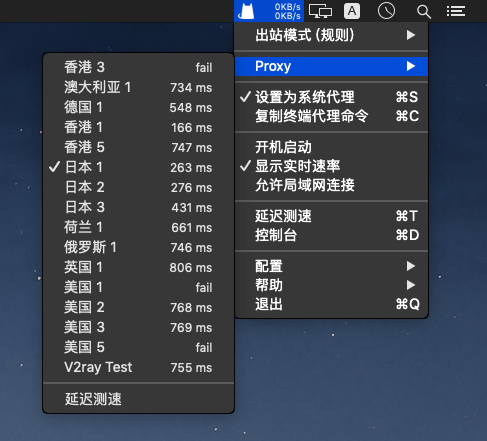  

注：由于测试方法的不同，这里的延迟与 ping 命令对应的延迟是不一样的。
如果需要测试与节点服务器之间的实际延迟，可以打开终端程序，通过输入 `ping 节点域名` 的命令进行测试

## 出站规则介绍  
点击 ClashX 图标，选择 `出站模式（规则）`，用于设置 ClashX 如何处理访问请求。
- `全局连接`：全局连接表示全部请求均通过代理，类似于 Shadowsocks 的全局模式
- `规则判断`：【推荐选择】表示按照配置文件内设置的规则区分是否为访问请求应用代理，类似于 Shadowsocks 的 PAC 模式
- `直接连接`：表示直接连接，不使用代理

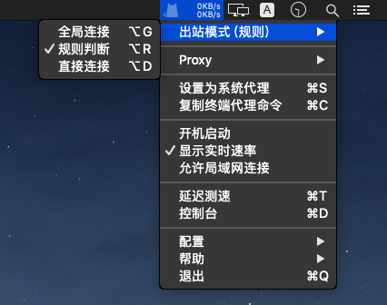

## Chrome / Firefox 配合 Proxy SwitchOmega 扩展
#### 	配置 Firefox 的代理

**如需使用 Firefox 浏览器	通过代理浏览网页，请参考下面链接：**  
[Firefox + Proxy SwitchyOmega 设置](../../zh_CN/browser/firefox-setup-guide.md)

#### 配置 Chrome 的代理

**如需使用 Chrome 浏览器通过代理浏览网页，请参考下面链接：**  
[Chrome + Proxy SwitchyOmega 设置](../../zh_CN/browser/chrome-setup-guide.md)

